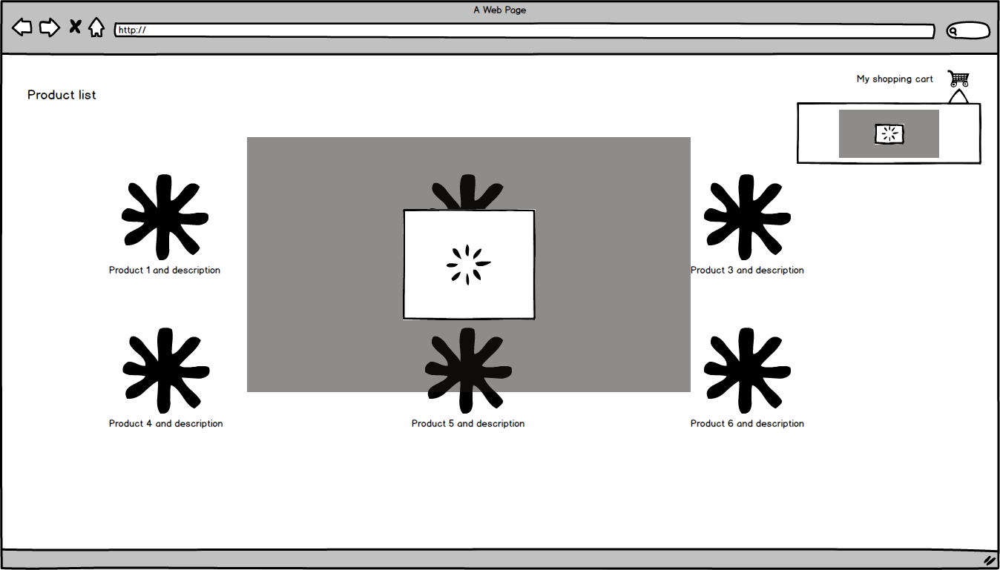

# react-promise-tracker

Simple promise tracker React Hoc. You can see it in action in this [Live Demo](https://stackblitz.com/edit/react-promise-tracker-default-area-sample), and find the basic info to get started in this [post](https://www.basefactor.com/react-how-to-display-a-loading-indicator-on-fetch-calls).

# Why do I need this?

Sometimes we need to track blocking promises (e.g. fetch http calls), to choose between displaying a loading spinner or not.

This library implements:
  - A simple function that will allow a promise to be tracked.
  - An HOC component that will allow us wrap a loading spinner (it will be displayed when the number of tracked request are greater than zero, and hidden when not).

# Installation

```cmd
npm install react-promise-tracker --save
```

# Usage

Whenever you want a promise to be tracked, just wrap it like in the code below:

```diff
+ import { trackPromise} from 'react-promise-tracker';
//...

+ trackPromise(
    fetchUsers(); // You function that returns a promise
+ );
```

Then you only need to create a component that will defined a property called _trackedPromiseInProgress_

And wrap it around the _promiseTrackerHoc_

## Basic sample:

```diff
import React, { Component } from 'react';
import PropTypes from 'prop-types';
+ import { promiseTrackerHoc} from 'react-promise-tracker';

const InnerLoadingSpinerComponent = (props) => {
  return (
    <div>
    {
      (props.trackedPromiseInProgress === true) ?
        <h3>Hey I'm a spinner loader wannabe !!!</h3>
      :
        null
    }
  </div>
  )
};

InnerLoadingSpinerComponent.propTypes = {
  trackedPromiseInProgress : PropTypes.bool.isRequired,
};

+ export const LoadingSpinnerComponent = promiseTrackerHoc(InnerLoadingSpinerComponent);
```

- To add a cool spinner component you can make use of _react-spinners_:

  - [Demo page](http://www.davidhu.io/react-spinners/)
  - [Github page](https://github.com/davidhu2000/react-spinners)


- Then in your application entry point (main / app / ...) just add this loading spinner to be displayed:

```diff
import React from 'react';
+ import { LoadingSpinnerComponent} from './loadingSpinner';

export const AppComponent = (props) => (
  <div>
    <h1>Hello App!</h1>
+   <LoadingSpinnerComponent />
  </div>
);
```

## Sample with areas:

Using react-promise-tracker as is will just display a single spinner in your page, there are cases where you want to display a given spinner only blocking certain area of the screen (e.g.: a product list app with a shopping cart section.
We would like to block the ui (show spinner) while is loading the product, but not the rest of the user interface, and the same thing with the shopping cart pop-up section.



We could add the `default-area` to show product list spinner:

```diff
import React from 'react';
+ import { LoadingSpinnerComponent} from './loadingSpinner';

export const ProductListComponent = (props) => (
  <div>
    ...
+   <LoadingSpinnerComponent /> // default-area
  </div>
);
```

And we add the `shopping-cart-area` to show shopping cart spinner:

```diff
import React from 'react';
+ import { LoadingSpinnerComponent} from './loadingSpinner';

export const ShoppingCartModal = (props) => (
  <div>
+   <LoadingSpinnerComponent area="shopping-cart-area" />
  </div>
);
```

With this approach, we don't need to define different spinners components, it's only one but it will render when we want to track the desired area:

```diff
+ import { trackPromise} from 'react-promise-tracker';
...
+ trackPromise(
    fetchSelectedProducts();
+ ,'shopping-cart-area');
```

# Demos

If you want to see it in action:

- [Default area example](https://stackblitz.com/edit/react-promise-tracker-default-area-sample)

- [Two areas example](https://stackblitz.com/edit/react-promise-tracker-two-areas-sample)


# About Lemoncode

We are a team of long-term experienced freelance developers, established as a group in 2010.
We specialize in Front End technologies and .NET. [Click here](http://lemoncode.net/services/en/#en-home) to get more info about us.

For the LATAM/Spanish audience we are running an Online Front End Master degree, more info: http://lemoncode.net/master-frontend
